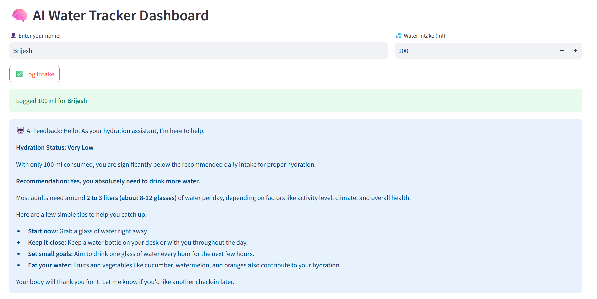
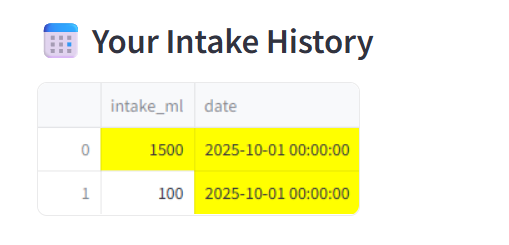
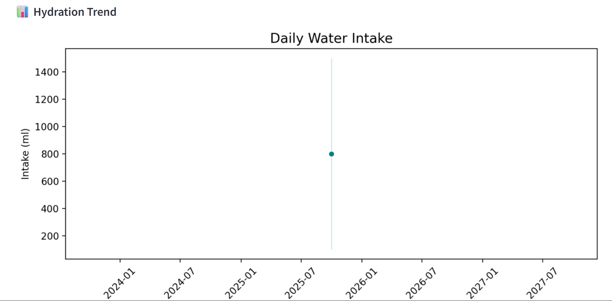
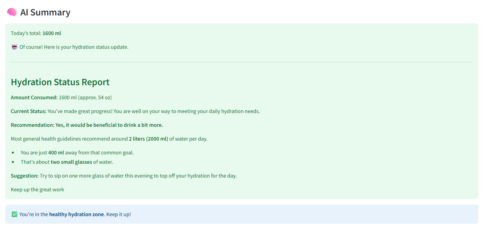

# AI Water Tracker

An intelligent water intake tracking application that uses AI to provide personalized hydration insights. Built with FastAPI backend, Streamlit frontend, and powered by Google's Gemini-2.5-pro model for smart analysis.

## 🚀 Features

- **AI-Powered Analysis**: Leverages Google's Gemini-2.5-pro model via LangChain to analyze hydration status and provide personalized recommendations.
- **User-Friendly Dashboard**: Interactive Streamlit interface for logging water intake and viewing history.
- **RESTful API**: FastAPI-based backend for programmatic access and integration.
- **Persistent Storage**: SQLite database for reliable data storage.
- **Comprehensive Logging**: All activities logged to `app.log` for monitoring and debugging.
- **Data Visualization**: Charts and graphs for tracking intake patterns over time.

## 🛠️ Tech Stack

- **Backend**: FastAPI (Python web framework)
- **Frontend**: Streamlit (Python data app framework)
- **AI/ML**: LangChain, Google Generative AI (Gemini-2.5-pro)
- **Database**: SQLite
- **Logging**: Python's built-in logging module
- **Visualization**: Matplotlib, Seaborn, Plotly
- **Scheduling**: APScheduler (for potential future reminders)
- **Other Libraries**: Pydantic for data validation, Uvicorn for ASGI server

## 📋 Prerequisites

- Python 3.8+
- Google Gemini API key (set in `.env` file as `GEMINI_API_KEY`)

## 🔧 Installation

1. **Clone the repository**:
   ```bash
   git clone https://github.com/your-username/ai-water-tracker.git
   cd ai-water-tracker
   ```

2. **Create a virtual environment**:
   ```bash
   python -m venv venv
   source venv/bin/activate  # On Windows: venv\Scripts\activate
   ```

3. **Install dependencies**:
   ```bash
   pip install -r requirements.txt
   ```

4. **Set up environment variables**:
   - Create a `.env` file in the root directory
   - Add your Google Gemini API key: `GEMINI_API_KEY=your_api_key_here`

5. **Initialize the database**:
   - The database (`water_tracker.db`) is automatically created when you run the application.

## 🚀 Usage

### Running the Streamlit Dashboard

```bash
streamlit run src/dashboard.py
```

This will start the web-based dashboard where users can:
- Enter their name and log water intake
- View AI-generated feedback on hydration status
- See historical intake data with visualizations

### Running the FastAPI Backend

```bash
uvicorn src.api:app --reload
```

The API will be available at `http://127.0.0.1:8000`

#### API Endpoints

- **POST /log-intake**: Log water intake
  - Request body: `{"user_id": "string", "intake_ml": "int"}`
  - Response: Confirmation message and AI analysis

- **GET /history/{user_id}**: Get intake history for a user
  - Response: List of intake records with dates

### Example API Usage

```python
import requests

# Log intake
response = requests.post("http://127.0.0.1:8000/log-intake", 
                        json={"user_id": "john_doe", "intake_ml": 1500})
print(response.json())

# Get history
response = requests.get("http://127.0.0.1:8000/history/john_doe")
print(response.json())
```

## 📊 Database Schema

The application uses SQLite with the following table:

```sql
CREATE TABLE water_intake (
    id INTEGER PRIMARY KEY AUTOINCREMENT,
    user_id TEXT,
    intake_ml INTEGER,
    date TEXT
);
```

- `id`: Auto-incrementing primary key
- `user_id`: Identifier for the user
- `intake_ml`: Amount of water consumed in milliliters
- `date`: Date of the intake (YYYY-MM-DD format)

## 📝 Logging

All application activities are logged to `app.log` with the following format:
```
%(asctime)s - %(levelname)s - %(message)s
```

Example log entries:
- User intake logging
- API requests
- Errors and warnings

## 🎨 Screenshots

### 1. Welcome Screen


### 2. Main Dashboard


### 3. Intake Logging


### 4. History and Analytics


## 🤖 AI Agent Details

The `WaterIntakeAgent` class uses LangChain's `ChatGoogleGenerativeAI` with the Gemini-2.5-pro model:

- **Model**: gemini-2.5-pro
- **Temperature**: 0.5 (balanced creativity and consistency)
- **Prompt Engineering**: Provides hydration status and drinking recommendations based on intake amount

The agent analyzes daily water intake and offers personalized feedback to help users maintain optimal hydration.

## 📁 Project Structure

```
├── src/
│   ├── agent.py          # AI agent for hydration analysis
│   ├── api.py            # FastAPI backend endpoints
│   ├── dashboard.py      # Streamlit frontend
│   ├── database.py       # SQLite database operations
│   ├── logger.py         # Logging utilities
│   └── water_tracker.db  # SQLite database file
├── git_assests/          # Screenshots and assets
│   ├── 1.png
│   ├── 2.png
│   ├── 3.png
│   └── 4.png
├── app.log               # Application logs
├── requirements.txt      # Python dependencies
└── README.md             # This file
```

## 🔒 Environment Variables

- `GEMINI_API_KEY`: Your Google Gemini API key (required for AI functionality)

## 🤝 Contributing

1. Fork the repository
2. Create a feature branch (`git checkout -b feature/amazing-feature`)
3. Commit your changes (`git commit -m 'Add some amazing feature'`)
4. Push to the branch (`git push origin feature/amazing-feature`)
5. Open a Pull Request

## 📄 License

This project is licensed under the MIT License - see the [LICENSE](LICENSE) file for details.

## 🙏 Acknowledgments

- Google for the Gemini AI model
- LangChain for the AI framework
- FastAPI and Streamlit communities for excellent Python frameworks</content>
<parameter name="filePath">f:\30 Days AI\1. Tracking Daily Water Intake\README.md